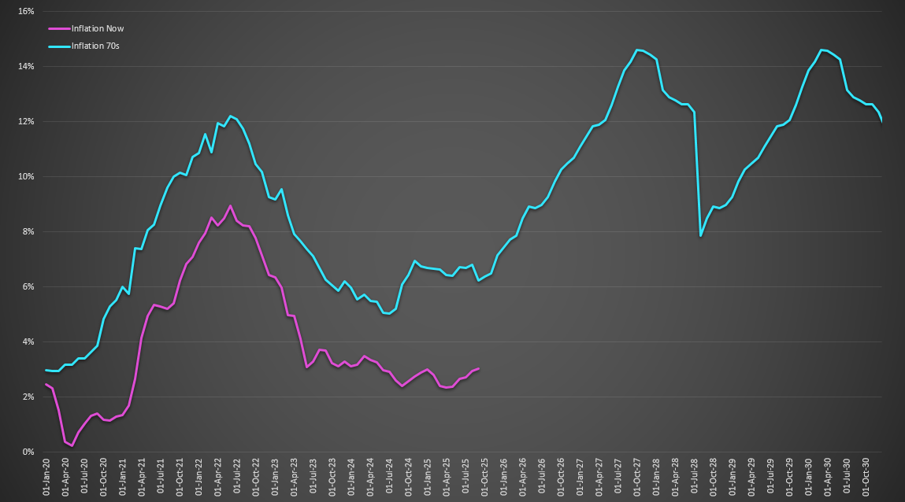
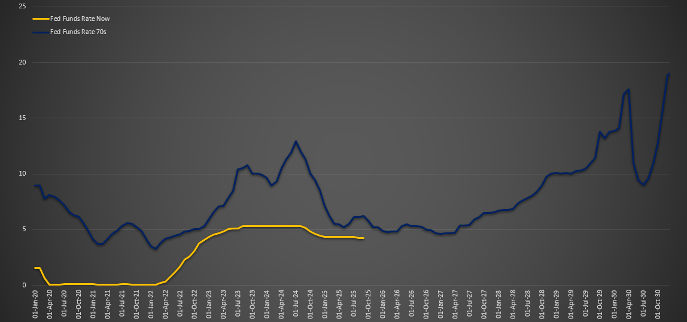

# Inflation_Now_Vs_70s

CPI Inflation Comparison 1970s and 2020s using Excel visualization.

- Data gathered from https://fred.stlouisfed.org/
- Used Excel to visualize CPI Inflation Now Vs. 1970s
- Alongside you find the FedFunds Rate Now Vs. 1970s which influences Inflation
- Note that the Inflation patterns are very similar - something to think about

- On the first Sheet of the workbook (CPI All Items) you will also find some pretty cool Statistics, Standard Deviation, Probabilities, Histograms, and Percentiles

